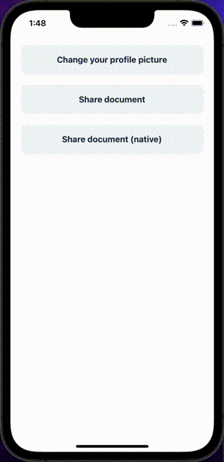

ActionSheets are sheets that slide up from the bottom of the screen, and present two or more choices related to an intentional user action.

## Import

```jsx
import { ActionSheet } from '@nomada-sh/react-native-eyecandy';
```

## Example

```SnackPlayer name=RN%20Eyecandy%20ActionSheet
import React from 'react';
import { SafeAreaView, ScrollView, Alert } from 'react-native';

import {
  Button,
  ActionSheet,
  ActionSheetOption,
} from '@nomada-sh/react-native-eyecandy';
import {
  Camera,
  Mail,
  Photo,
  Eye,
  Download,
} from '@nomada-sh/react-native-eyecandy-icons';

const profilePictureOptions = [
  {
    label: 'Take a photo',
    icon: Camera,
  },
  {
    label: 'Choose from gallery',
    icon: Photo,
  },
];

const shareDocumentOptions = [
  {
    label: 'Download',
    icon: Download,
  },
  {
    label: 'Share',
    icon: Mail,
  },
  {
    label: 'Preview',
    icon: Eye,
  },
];

export default function App() {
  const [visibleChangePicture, setVisibleChangePicture] = React.useState(false);
  const [visibleShare, setVisibleShare] = React.useState(false);

  return (
    <SafeAreaView
      style={{
        flex: 1,
      }}
    >
      <ScrollView
        contentContainerStyle={{
          padding: 20,
        }}
      >
        <Button
          marginBottom={20}
          onPress={() => setVisibleChangePicture(true)}
          text="Change your profile picture"
        />
        <ActionSheet
          title="Change your profile picture"
          message="Select a new profile picture"
          options={profilePictureOptions}
          visible={visibleChangePicture}
          onClose={() => setVisibleChangePicture(false)}
          onPressAction={index => {
            const option = profilePictureOptions[index];
            if (typeof option === 'string') Alert.alert(option);
            else Alert.alert(option.label);
          }}
          showCancelIcon
        />

        <Button
          marginBottom={20}
          onPress={() => setVisibleShare(true)}
          text="Share document"
        />
        <ActionSheet
          options={shareDocumentOptions}
          visible={visibleShare}
          onClose={() => setVisibleShare(false)}
          onPressAction={index => {
            const option = shareDocumentOptions[index];
            if (typeof option === 'string') Alert.alert(option);
            else Alert.alert(option.label);
          }}
          showCancelIcon
        />
      </ScrollView>
    </SafeAreaView>
  );
}
```

<!--  -->

## Props

### <div class="label required basic">Required</div>**`options`**

| Type                                      |
| ----------------------------------------- |
| [ActionSheetOption](#actionsheetoption)[] |

---

### `visible`

| Type    |
| ------- |
| boolean |

---

### `title`

| Type   |
| ------ |
| string |

---

### `message`

| Type   |
| ------ |
| string |

---

### `onClose`

```jsx
() => void;
```

| Type     |
| -------- |
| function |

---

### `onPressAction`

```jsx
(index: number) => void;
```

| Type     |
| -------- |
| function |

---

### `onCancel`

```jsx
() => void;
```

| Type     |
| -------- |
| function |

---

### `showCancelIcon`

| Type    |
| ------- |
| boolean |

---

### `cancelText`

| Type   | Default    |
| ------ | ---------- |
| string | `'Cancel'` |

---

### `native`

When set to `true`, the action sheet will be rendered natively on iOS or Android.

#### Example

```SnackPlayer name=RN%20Eyecandy%20ActionSheet%20Native&supportedPlatforms=ios,android
import React from 'react';
import { SafeAreaView, View, Alert } from 'react-native';

import {
  Button,
  ActionSheet,
  ActionSheetOption,
} from '@nomada-sh/react-native-eyecandy';

const options = [
  'Download',
  'Share',
  'Preview',
];

export default function App() {
  const [visible, setVisible] = React.useState(false);

  return (
    <SafeAreaView
      style={{
        flex: 1,
      }}
    >
      <View
        style={{
          padding: 20,
        }}
      >
        <Button
          marginBottom={20}
          onPress={() => setVisible(true)}
          text="Share document"
        />
        <ActionSheet
          native
          options={options}
          visible={visible}
          onClose={() => setVisible(false)}
          onPressAction={index => {
            const option = options[index];
            if (typeof option === 'string') Alert.alert(option);
            else Alert.alert(option.label);
          }}
          showCancelIcon
        />
      </View>
    </SafeAreaView>
  );
}
```

| Type    |
| ------- |
| boolean |

---

### `dark` <div class="label ios">iOS</div>

When set to `true`, the action sheet will be rendered in dark mode on iOS.

| Type    |
| ------- |
| boolean |

## Type definitions

### ActionSheetOption

| Type           |
| -------------- |
| string, object |

When the type is string, the string is the label of the option.

When the type is object, the object must have the following properties:

| Name  | Type             | Required | Description             |
| ----- | ---------------- | -------- | ----------------------- |
| label | string           | Yes      | The label of the option |
| icon  | [Icon](../icons) | No       | The icon of the option  |
