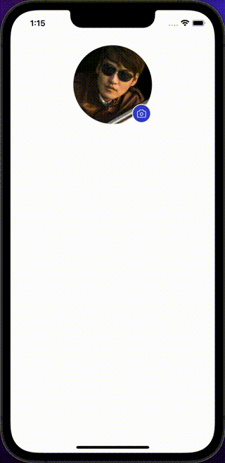

AvatarEdits enable users to upload a new profile picture, or edit their current profile picture.

## Import

```jsx
import { AvatarEdit } from '@nomada-sh/react-native-eyecandy';
```

## Example

```SnackPlayer name=RN%20Eyecandy%20AvatarEdit
import React from 'react';
import { ImageSourcePropType, SafeAreaView, ScrollView } from 'react-native';

import { AvatarEdit } from '@nomada-sh/react-native-eyecandy';

export default function App() {
  const [source, setSource] = React.useState({
    uri: 'https://i.pravatar.cc/300',
  });

  return (
    <SafeAreaView
      style={{
        flex: 1,
      }}
    >
      <ScrollView
        contentContainerStyle={{
          padding: 20,
          alignItems: 'center',
        }}
      >
        <AvatarEdit
          size={150}
          source={source}
          onChange={image => {
            if (image) setSource(image);
          }}
        />
      </ScrollView>
    </SafeAreaView>
  );
}
```

<!--  -->

## Props

### [Pressable Props](https://reactnative.dev/docs/pressable#props)

Inherits [Pressable Props](https://reactnative.dev/docs/pressable#props).

---

### <div class="label required basic">Required</div>**`source`**

| Type                                                          |
| ------------------------------------------------------------- |
| [ImageSource](https://reactnative.dev/docs/image#imagesource) |

---

### `size`

Width and height of the avatar.

| Type   | Default |
| ------ | ------- |
| number | `100`   |

---

### `onChange`

```jsx
(source: ImageSource | undefined, error: {
  code: number;
  message: string;
} | undefined) => void;
```

| Type     |
| -------- |
| function |

- 'source' ([ImageSource](https://reactnative.dev/docs/image#imagesource)): The new image source of the avatar.
- 'error' (object): The error object if the image source is invalid.

---

### `fromGalleryText`

| Type   | Default          |
| ------ | ---------------- |
| string | `'From Gallery'` |

---

### `fromCameraText`

| Type   | Default         |
| ------ | --------------- |
| string | `'From Camera'` |

---

### `title`

| Type   | Default           |
| ------ | ----------------- |
| string | `'Change Avatar'` |

---

### `style`

| Type       |
| ---------- |
| View Style |
