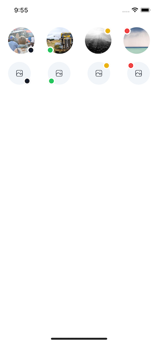

Badges are small components typically used to indicate the status of an item, such as "new" or "unread", to the user.

## Import

```jsx
import { Badge } from '@nomada-sh/react-native-eyecandy';
```

## Example

```SnackPlayer name=RN%20Eyecandy%20Badge
import React from 'react';
import { ScrollView, View } from 'react-native';

import { IconButton, Badge, Avatar } from '@nomada-sh/react-native-eyecandy';
import { Photo } from '@nomada-sh/react-native-eyecandy-icons';

export default function App() {
  return (
    <ScrollView
      contentContainerStyle={{
        padding: 20,
        flexDirection: 'row',
        justifyContent: 'space-between',
      }}
    >
      <Badge>
        <Avatar
          source={{
            uri: 'https://picsum.photos/200/300',
          }}
        />
      </Badge>
      <Badge
        color="success"
        anchorOrigin={{
          horizontal: 'left',
          vertical: 'bottom',
        }}
      >
        <Avatar
          source={{
            uri: 'https://picsum.photos/200/300',
          }}
        />
      </Badge>
      <Badge
        color="warning"
        anchorOrigin={{
          horizontal: 'right',
          vertical: 'top',
        }}
      >
        <Avatar
          source={{
            uri: 'https://picsum.photos/200/300',
          }}
        />
      </Badge>
      <Badge
        color="error"
        anchorOrigin={{
          horizontal: 'left',
          vertical: 'top',
        }}
      >
        <Avatar
          source={{
            uri: 'https://picsum.photos/200/300',
          }}
        />
      </Badge>
    </ScrollView>
  );
}
```

<!--  -->

## Props

### [View Props](https://reactnative.dev/docs/view#props)

Inherits [View Props](https://reactnative.dev/docs/view#props).

---

### `color`

| Type                                                                                 | Default     |
| ------------------------------------------------------------------------------------ | ----------- |
| `'default'` or `'primary'` or `'error'` or `'warning'` or `'success'` or `'greyout'` | `'default'` |

---

### `size`

| Type   | Default |
| ------ | ------- |
| number | `18`    |

---

### `anchorOrigin`

| Type                          | Default                                       |
| ----------------------------- | --------------------------------------------- |
| [AnchorOrigin](#anchororigin) | `{ vertical: 'bottom', horizontal: 'right' }` |

---

### `badgeStyle`

| Type       |
| ---------- |
| View Style |

## Type Definitions

### AnchorOrigin

| Type   |
| ------ |
| object |

#### Properties

| Name       | Type                  | Required | Description                       |
| ---------- | --------------------- | -------- | --------------------------------- |
| horizontal | `'left'` or `'right'` | Yes      | Horizontal position of the badge. |
| vertical   | `'top'` or `'bottom'` | Yes      | Vertical position of the badge.   |
