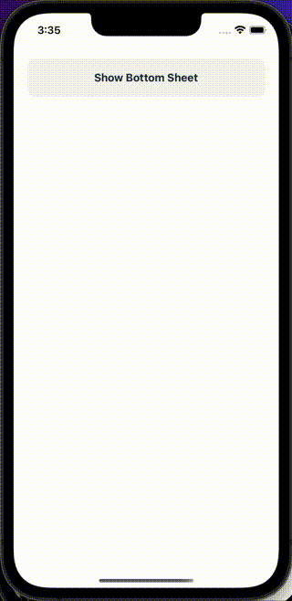

BottomSheets are sheets that slide up from the bottom of the screen. You can put any content you want inside.

## Import

```jsx
import { BottomSheet } from '@nomada-sh/react-native-eyecandy';
```

## Example

```SnackPlayer name=RN%20Eyecandy%20BottomSheet
import React from 'react';
import { ScrollView, View } from 'react-native';

import {
  Body,
  BottomSheet,
  Button,
  IconButton,
} from '@nomada-sh/react-native-eyecandy';
import {
  Camera,
  Mail,
  Photo,
  Star,
} from '@nomada-sh/react-native-eyecandy-icons';

export default function App() {
  const [visible, setVisible] = React.useState(false);

  return (
    <ScrollView
      contentContainerStyle={{
        padding: 20,
      }}
    >
      <Button onPress={() => setVisible(true)} text="Show Bottom Sheet" />
      <BottomSheet
        visible={visible}
        height={160}
        onClose={() => setVisible(false)}
        contentStyle={{
          padding: 20,
        }}
      >
        <Body marginBottom={20} weight="bold" align="center">
          Hello, I am a bottom sheet.
        </Body>
        <View
          style={{
            flexDirection: 'row',
            justifyContent: 'space-between',
          }}
        >
          <IconButton icon={Camera} onPress={() => setVisible(false)} />
          <IconButton icon={Photo} onPress={() => setVisible(false)} />
          <IconButton icon={Star} onPress={() => setVisible(false)} />
          <IconButton icon={Mail} onPress={() => setVisible(false)} />
        </View>
      </BottomSheet>
    </ScrollView>
  );
}
```

<!--  -->

## Props

### <div class="label required basic">Required</div>**`height`**

Height of the bottom sheet.

| Type   |
| ------ |
| number |

---

### `handleHeight`

Height of the bottom sheet handle.

| Type   | Default |
| ------ | ------- |
| number | `40`    |

---

### `visible`

If `true`, the bottom sheet is visible.

| Type    | Default |
| ------- | ------- |
| boolean | `false` |

---

### `onClose`

```jsx
() => void;
```

Callback function to be called when the bottom sheet is closed.

| Type     |
| -------- |
| function |

---

### `contentStyle`

These styles will be applied to the bottom sheet content view.

| Type       |
| ---------- |
| View Style |

---

### `handleStyle`

These styles will be applied to the bottom sheet handle view.

| Type       |
| ---------- |
| View Style |

---

### `disableAnimations`

Disable opening and closing animations, useful for testing.

| Type    | Default |
| ------- | ------- |
| boolean | `false` |

---

### `testID`

Used to locate bottom sheet views in end-to-end tests.

| Type   |
| ------ |
| string |
