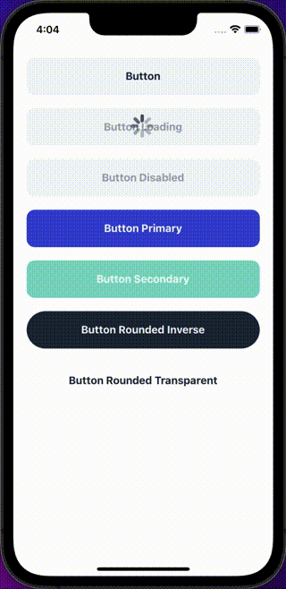

## Import

```jsx
import { Button } from '@nomada-sh/react-native-eyecandy';
```

## Example

```tsx
import React from 'react';
import { Alert, ScrollView } from 'react-native';

import { Button } from '@nomada-sh/react-native-eyecandy';

export default function App() {
  return (
    <ScrollView
      contentContainerStyle={{
        padding: 20,
      }}
    >
      <Button
        marginBottom={20}
        onPress={() => {
          Alert.alert('Button pressed');
        }}
      >
        Button
      </Button>
      <Button marginBottom={20} loading>
        Button Loading
      </Button>
      <Button marginBottom={20} disabled>
        Button Disabled
      </Button>
      <Button
        marginBottom={20}
        color="primary"
        onLongPress={() => {
          Alert.alert('Button long pressed');
        }}
      >
        Button Primary
      </Button>
      <Button
        marginBottom={20}
        color="secondary"
        onPressIn={() => {
          Alert.alert('Button pressed in');
        }}
        onPressOut={() => {
          Alert.alert('Button pressed out');
        }}
      >
        Button Secondary
      </Button>
      <Button variant="rounded" marginBottom={20} inverse>
        Button Rounded Inverse
      </Button>
      <Button variant="rounded" transparent>
        Button Rounded Transparent
      </Button>
    </ScrollView>
  );
}
```



## Props

### [ButtonBase Props](buttonbase#props)

Inherits [ButtonBase Props](buttonbase#props)

---

### `children`

Text to display on the button.

| Type   |
| ------ |
| string |

---

### `textStyle`

These styles will be applied to the text inside the button.

| Type       |
| ---------- |
| Text Style |
