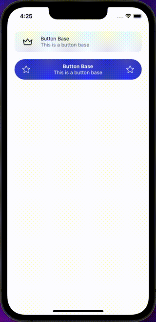

ButtonBase is a generic component that provides a foundation for building all sorts of buttons. It can be used as a standalone component, or as the base for other button-like components.

## Import

```jsx
import { ButtonBase } from '@nomada-sh/react-native-eyecandy';
```

## Example

```SnackPlayer name=RN%20Eyecandy%20ButtonBase
import React from 'react';
import { Alert, ScrollView, View } from 'react-native';

import { Body, ButtonBase } from '@nomada-sh/react-native-eyecandy';
import { Crown, Star } from '@nomada-sh/react-native-eyecandy-icons';

export default function App() {
  return (
    <ScrollView
      contentContainerStyle={{
        padding: 20,
        flex: 1,
        justifyContent: 'center',
      }}
    >
      <ButtonBase
        onPress={() => {
          Alert.alert('Button pressed');
        }}
        pressableStyle={{
          flexDirection: 'row',
          justifyContent: 'flex-start',
          paddingHorizontal: 20,
        }}
        marginBottom={20}
      >
        <Crown size={32} />
        <View
          style={{
            marginLeft: 20,
          }}
        >
          <Body>Button Base</Body>
          <Body color="greyout">This is a button base</Body>
        </View>
      </ButtonBase>
      <ButtonBase
        onLongPress={() => {
          Alert.alert('Button long pressed');
        }}
        variant="rounded"
        color="primary"
        pressableStyle={{
          flexDirection: 'row',
          justifyContent: 'flex-start',
          paddingHorizontal: 20,
        }}
        height={64}
      >
        <Star color="white" />
        <View
          style={{
            flex: 1,
            marginHorizontal: 20,
          }}
        >
          <Body weight="bold" color="white" align="center">
            Button Base
          </Body>
          <Body color="white" align="center" size="small">This is a button base</Body>
        </View>
        <Star color="white" />
      </ButtonBase>
    </ScrollView>
  );
}
```

<!--  -->

## Props

### [Pressable Props](https://reactnative.dev/docs/pressable#props)

Inherits [Pressable Props](https://reactnative.dev/docs/pressable#props).

---

### `style`

These styles will be applied to the container view.

| Type       |
| ---------- |
| View Style |

---

### `pressableStyle`

These styles will be applied to the pressable view.

| Type       |
| ---------- |
| View Style |

---

### `styles`

This styles are applied before [`pressableStyle`](#pressableStyle) and [`style`](#style).

| Type   |
| ------ |
| object |

#### Properties

| Name        | Type       | Required | Description                                         |
| ----------- | ---------- | -------- | --------------------------------------------------- |
| `container` | View Style | No       | These styles will be applied to the container view. |
| `pressable` | View Style | No       | These styles will be applied to the pressable view. |

---

### `color`

This defines the background and foreground colors of the button. The color will change based on the theme (dark or light) if set to `'default'`.

| Type                                        | Default     |
| ------------------------------------------- | ----------- |
| `'default'` or `'primary'` or `'secondary'` | `'default'` |

---

### `inverse`

If `true`, inverts the background and foreground colors set with the [`color`](#color) prop.

| Type    | Default |
| ------- | ------- |
| boolean | `false` |

---

### `variant`

This defines the variant, or look, of the component to use.

Possible values:

- `'default'` adds squared corners to the button.
- `'rounded'` adds rounded corners to the button.
- `'squared'` adds squared corners to the button.

| Type                                      | Default     |
| ----------------------------------------- | ----------- |
| `'default'` or `'rounded'` or `'squared'` | `'default'` |

---

### `fullWidth`

If set to `true`, the button will expand to fill the width of its container.

| Type    | Default |
| ------- | ------- |
| boolean | `true`  |

---

### `height`

This defines the height of the button.

| Type   | Default |
| ------ | ------- |
| number | `56`    |

---

### `transparent`

If `true`, the background color set with the [`color`](#color) prop will be transparent.

| Type    | Default |
| ------- | ------- |
| boolean | `false` |

---

### `outlined`

If `true`, adds a border of the same color as the foreground color set with the [`color`](#color) prop.

| Type    | Default |
| ------- | ------- |
| boolean | `false` |

---

### `loading`

If `true`, shows a loading spinner on top of button content.

| Type    | Default |
| ------- | ------- |
| boolean | `false` |

---

### `hideDisabledOverlay`

If `true`, the disabled overlay will not be shown on the button when disabled.

| Type    | Default |
| ------- | ------- |
| boolean | `false` |

---

### `disableHapticFeedback`

If `true`, the button will not trigger a haptic feedback on press.

| Type    | Default |
| ------- | ------- |
| boolean | `false` |

---

### `marginTop`

| Type   |
| ------ |
| number |

---

### `marginBottom`

| Type   |
| ------ |
| number |
