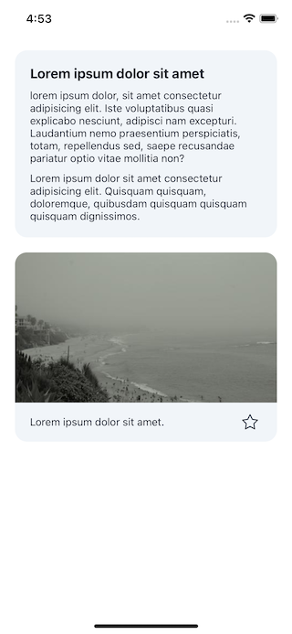

## Import

```jsx
import { Card } from '@nomada-sh/react-native-eyecandy';
```

## Example

```tsx
import React from 'react';
import { ScrollView, View, ImageBackground } from 'react-native';

import { Body, Card, IconButton } from '@nomada-sh/react-native-eyecandy';
import { Star } from '@nomada-sh/react-native-eyecandy-icons';

export default function App() {
  const [like, setLike] = React.useState(false);

  return (
    <ScrollView
      contentContainerStyle={{
        padding: 20,
      }}
    >
      <Card marginBottom={20}>
        <Body marginBottom={10} weight="bold" size="xlarge">
          Lorem ipsum dolor sit amet
        </Body>
        <Body marginBottom={10}>
          lorem ipsum dolor, sit amet consectetur adipisicing elit. Iste
          voluptatibus quasi explicabo nesciunt, adipisci nam excepturi.
          Laudantium nemo praesentium perspiciatis, totam, repellendus sed,
          saepe recusandae pariatur optio vitae mollitia non?
        </Body>
        <Body>
          Lorem ipsum dolor sit amet consectetur adipisicing elit. Quisquam
          quisquam, doloremque, quibusdam quisquam quisquam quisquam
          dignissimos.
        </Body>
      </Card>
      <Card padding={0}>
        <ImageBackground
          source={{
            uri: 'https://picsum.photos/480/320',
          }}
          style={{
            width: '100%',
            height: 200,
          }}
        />
        <View
          style={{
            flexDirection: 'row',
            alignItems: 'center',
            justifyContent: 'space-between',
            paddingVertical: 10,
            paddingHorizontal: 20,
          }}
        >
          <Body>Lorem ipsum dolor sit amet.</Body>
          <IconButton
            onPress={() => {
              setLike(!like);
            }}
            iconColor={like ? 'red' : undefined}
            size={32}
            iconSize={24}
            icon={Star}
          />
        </View>
      </Card>
    </ScrollView>
  );
}
```



## Props

### [View Props](https://reactnative.dev/docs/view#props)

Inherits [View Props](https://reactnative.dev/docs/view#props).

---

### `marginBottom`

| Type   |
| ------ |
| number |

---

### `marginTop`

| Type   |
| ------ |
| number |

---

### `padding`

| Type   |
| ------ |
| number |
