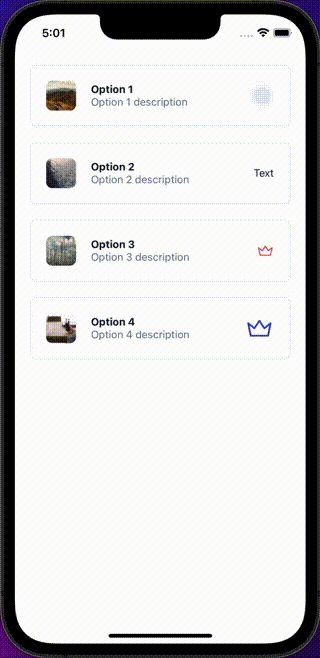

## Import

```jsx
import { CheckList } from '@nomada-sh/react-native-eyecandy';
```

## Example

```tsx
import React from 'react';
import { ScrollView } from 'react-native';

import {
  Body,
  CheckList,
  CheckListOption,
} from '@nomada-sh/react-native-eyecandy';
import { Check, Crown } from '@nomada-sh/react-native-eyecandy-icons';

export default function App() {
  const [selected, setSelected] = React.useState<string[]>([]);

  return (
    <ScrollView>
      <CheckList
        maxSelected={2}
        selected={selected}
        onSelectedChange={setSelected}
        style={{
          padding: 20,
        }}
      >
        <CheckListOption
          id="1"
          title="Option 1"
          description="Option 1 description"
          value="Option 1"
          image={{
            uri: 'https://picsum.photos/300/400',
          }}
        />
        <CheckListOption
          id="2"
          title="Option 2"
          description="Option 2 description"
          value="Option 2"
          image={{
            uri: 'https://picsum.photos/400/400',
          }}
          checkComponent={({ selected }) =>
            selected ? <Check /> : <Body>Text</Body>
          }
        />
        <CheckListOption
          id="3"
          title="Option 3"
          description="Option 3 description"
          value="Option 3"
          image={{
            uri: 'https://picsum.photos/400/500',
          }}
          checkComponent={({ selected }) =>
            selected ? <Crown /> : <Crown color="error" />
          }
        />
        <CheckListOption
          id="4"
          title="Option 4"
          description="Option 4 description"
          value="Option 4"
          image={{
            uri: 'https://picsum.photos/500/400',
          }}
          checkComponent={<Crown color="primary" size={40} />}
        />
      </CheckList>
    </ScrollView>
  );
}
```



## Props

### [View Props](https://reactnative.dev/docs/view#props)

Inherits [View Props](https://reactnative.dev/docs/view#props).

---

### <div class="label required basic">Required</div>**`children`**

| Type                                                                       |
| -------------------------------------------------------------------------- |
| [CheckListOption](checklistoption) or [CheckListOption](checklistoption)[] |

---

### <div class="label required basic">Required</div>**`selected`**

| Type     |
| -------- |
| string[] |

---

### <div class="label required basic">Required</div>**`onSelectedChange`**

```jsx
(selected: string[]) => void;
```

| Type     |
| -------- |
| function |

- 'selected' (string[]): array of selected item ids.

---

### `onPress`

```jsx
({ id: string, value: any }) => void;
```

| Type     |
| -------- |
| function |

- 'id' (string): id of the option.
- 'value' (any): value of the option.

---

### `maxSelected`

| Type   |
| ------ |
| number |

---

### `marginBottom`

| Type   | Default |
| ------ | ------- |
| number | 20      |
