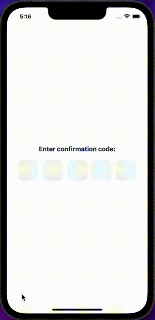

CodeInputs are inputs used to enter confirmation codes. They can be used to enter double-factor authentication codes.

## Import

```jsx
import { CodeInput } from '@nomada-sh/react-native-eyecandy';
```

## Example

```tsx
import React from 'react';
import { View, Alert } from 'react-native';

import { Body, CodeInput } from '@nomada-sh/react-native-eyecandy';

export default function App() {
  return (
    <View
      style={{
        padding: 20,
        justifyContent: 'center',
        flex: 1,
      }}
    >
      <Body marginBottom={20} weight="bold" size="xlarge" align="center">
        Enter confirmation code:
      </Body>
      <CodeInput
        onFinish={code => {
          Alert.alert(`Code: ${code}`);
        }}
        length={5}
      />
    </View>
  );
}
```



## Props

### <div class="label required basic">Required</div>**`onFinish`**

```jsx
(code: string) => void;
```

| Type     |
| -------- |
| function |

---

### <div class="label required basic">Required</div>**`length`**

| Type   |
| ------ |
| number |

---

### `style`

These styles will be applied to the input container view.

| Type       |
| ---------- |
| View Style |

---

### `dismissKeyboardOnFinish`

| Type    | Default |
| ------- | ------- |
| boolean | `true`  |

---

### `size`

| Type   | Default |
| ------ | ------- |
| number | `56`    |

---

### `marginTop`

| Type   |
| ------ |
| number |

---

### `marginBottom`

| Type   |
| ------ |
| number |
