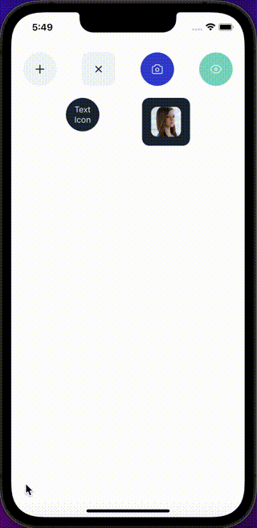

## Import

```jsx
import { IconButton } from '@nomada-sh/react-native-eyecandy';
```

## Example

```tsx
import React from 'react';
import { Alert, ScrollView, View, Image } from 'react-native';

import { Body, IconButton } from '@nomada-sh/react-native-eyecandy';
import {
  Plus,
  Close,
  Camera,
  Eye,
} from '@nomada-sh/react-native-eyecandy-icons';

export default function App() {
  return (
    <ScrollView
      contentContainerStyle={{
        padding: 20,
      }}
    >
      <View
        style={{
          flexDirection: 'row',
          justifyContent: 'space-between',
          marginBottom: 20,
        }}
      >
        <IconButton icon={Plus} onPress={() => Alert.alert('Plus')} />
        <IconButton
          variant="default"
          icon={Close}
          onPress={() => Alert.alert('Close')}
        />
        <IconButton
          color="primary"
          icon={Camera}
          onPress={() => Alert.alert('Camera')}
        />
        <IconButton
          color="secondary"
          icon={Eye}
          onPress={() => Alert.alert('Eye')}
        />
      </View>
      <View
        style={{
          flexDirection: 'row',
          justifyContent: 'space-evenly',
        }}
      >
        <IconButton
          inverse
          icon={({ stroke }) => {
            return (
              <Body
                style={{
                  color: stroke,
                  textAlign: 'center',
                }}
              >
                Text Icon
              </Body>
            );
          }}
          onPress={() => Alert.alert('Text icon')}
        />
        <IconButton
          inverse
          size={80}
          variant="default"
          icon={() => {
            return (
              <Image
                borderRadius={10}
                style={{
                  width: 50,
                  height: 50,
                }}
                source={{
                  uri: 'https://i.pravatar.cc/300',
                }}
              />
            );
          }}
          onPress={() => Alert.alert('Image icon')}
        />
      </View>
    </ScrollView>
  );
}
```



## Props

### [ButtonBase Props](buttonbase#props)

Inherits [ButtonBase Props](buttonbase#props)

Has the following default props:

| Prop    | Default     |
| ------- | ----------- |
| variant | `'rounded'` |

---

### `icon`

| Type             |
| ---------------- |
| [Icon](../icons) |

---

### `size`

This sets the width and height of the container view.

| Type   | Default |
| ------ | ------- |
| number | `56`    |

---

### `iconSize`

This sets the width and height of the icon. When not set, the icon will be automatically sized according to the container view.

| Type   |
| ------ |
| number |

---

### `iconColor`

The icon color will be the foreground color set with the [`color`](buttonbase#color) prop unless explicitly set.

| Type   |
| ------ |
| string |

---

### `iconStyle`

| Type       |
| ---------- |
| View Style |
