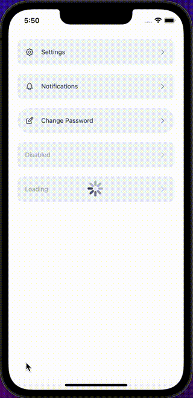

## Import

```jsx
import { LinkButton } from '@nomada-sh/react-native-eyecandy';
```

## Example

```tsx
import { Alert, ScrollView } from 'react-native';

import { LinkButton } from '@nomada-sh/react-native-eyecandy';
import {
  Edit,
  Notifications,
  Settings,
} from '@nomada-sh/react-native-eyecandy-icons';

export default function App() {
  return (
    <ScrollView
      contentContainerStyle={{
        padding: 20,
      }}
    >
      <LinkButton
        marginBottom={20}
        icon={Settings}
        onPress={() => Alert.alert('Go to Settings')}
      >
        Settings
      </LinkButton>
      <LinkButton
        marginBottom={20}
        icon={Notifications}
        onPress={() => Alert.alert('Go to Notifications')}
      >
        Notifications
      </LinkButton>
      <LinkButton
        marginBottom={20}
        variant="rounded"
        icon={Edit}
        onPress={() => Alert.alert('Go to Change Password')}
      >
        Change Password
      </LinkButton>
      <LinkButton disabled marginBottom={20}>
        Disabled
      </LinkButton>
      <LinkButton loading marginBottom={20}>
        Loading
      </LinkButton>
    </ScrollView>
  );
}
```



## Props

### [ButtonBase Props](buttonbase#props)

Inherits [ButtonBase Props](buttonbase#props)

---

### `icon`

| Type             |
| ---------------- |
| [Icon](../icons) |

---

### `children`

Text to display on the button.

| Type   |
| ------ |
| string |

---

### `showChevronRight`

If `true`, renders a chevron right icon on the right side of the button.

| Type    | Default |
| ------- | ------- |
| boolean | true    |

---

### `bold`

If `true`, the text will be bold.

| Type    | Default |
| ------- | ------- |
| boolean | false   |

### `focused`

If `true`, the button will have a border color equal to the primary color.

| Type    | Default |
| ------- | ------- |
| boolean | false   |
