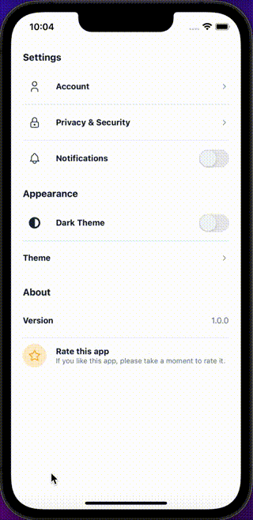

## Import

```jsx
import { Menu } from '@nomada-sh/react-native-eyecandy';
```

## Example

```SnackPlayer name=RN%20Eyecandy%20Menu
import React from 'react';
import { Alert, ScrollView, View } from 'react-native';

import {
  Body,
  Menu,
  MenuItem,
  MenuItemBase,
  MenuItemSwitch,
  MenuItemValue,
} from '@nomada-sh/react-native-eyecandy';
import {
  User,
  Notifications,
  MoonSun,
  Lock,
  Star,
} from '@nomada-sh/react-native-eyecandy-icons';

export default function App() {
  const [notifications, setNotifications] = React.useState(false);
  const [darkTheme, setDarkTheme] = React.useState(false);

  return (
    <ScrollView>
      <Menu title="Settings">
        <MenuItem
          onPress={() => Alert.alert('Go to account')}
          icon={User}
          separator
          text="Account"
        />
        <MenuItem
          onPress={() => Alert.alert('Go to Privacy & Security')}
          icon={Lock}
          separator
          text="Privacy & Security"
        />
        <MenuItemSwitch
          icon={Notifications}
          onPress={() => setNotifications(!notifications)}
          text="Notifications"
          value={notifications}
          onValueChange={setNotifications}
        />
      </Menu>
      <Menu title="Appearance">
        <MenuItemSwitch
          separator
          icon={MoonSun}
          onPress={() => setDarkTheme(!darkTheme)}
          text="Dark Theme"
          value={darkTheme}
          onValueChange={setDarkTheme}
        />
        <MenuItem
          onPress={() => Alert.alert('Go to Theme')}
          contentContainerStyle={{
            paddingVertical: 20,
          }}
          text="Theme"
        />
      </Menu>
      <Menu title="About">
        <MenuItemValue
          separator
          contentContainerStyle={{
            paddingVertical: 20,
          }}
          text="Version"
          value="1.0.0"
        />
        <MenuItemBase
          icon={Star}
          iconColor="orange"
          iconBackgroundColor="rgba(255, 165, 0, 0.2)"
        >
          <View>
            <Body weight="bold">Rate this app</Body>
            <Body size="small" color="greyout">
              If you like this app, please take a moment to rate it.
            </Body>
          </View>
        </MenuItemBase>
      </Menu>
    </ScrollView>
  );
}
```

<!--  -->

## Props

### [View Props](https://reactnative.dev/docs/view#props)

Inherits [View Props](https://reactnative.dev/docs/view#props).

---

### `title`

| Type   |
| ------ |
| string |
