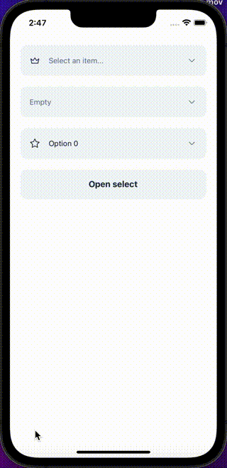

## Import

```jsx
import { NativeSelect } from '@nomada-sh/react-native-eyecandy';
```

## Example

```SnackPlayer name=RN%20Eyecandy%20NativeSelect&supportedPlatforms=ios,android
import React, { useRef } from 'react';
import { ScrollView } from 'react-native';

import {
  Button,
  NativeSelect,
  NativeSelectItem,
} from '@nomada-sh/react-native-eyecandy';
import { Crown, Star } from '@nomada-sh/react-native-eyecandy-icons';

const items1 = [
  ...Array.from({ length: 100 }, (_, i) => ({
    label: `Option ${i}`,
    value: `option${i}`,
  })),
];

const items2 = [
  ...Array.from({ length: 10 }, (_, i) => ({
    label: `Option ${i}`,
    value: `option${i}`,
  })),
];

export default function App() {
  const [v1, setV1] = React.useState(undefined);
  const [v2, setV2] = React.useState('option0');

  const ref = useRef(null);

  return (
    <ScrollView
      contentContainerStyle={{
        padding: 20,
      }}
    >
      <NativeSelect
        value={v1}
        marginBottom={20}
        icon={Crown}
        items={items1}
        onChange={setV1}
      />
      <NativeSelect marginBottom={20} ref={ref} emptyText="Empty" />
      <NativeSelect
        value={v2}
        onChange={setV2}
        items={items2}
        ref={ref}
        marginBottom={20}
        icon={Star}
      />
      <Button
        onPress={() => {
          ref.current?.focus();
        }}
      >
        Open select
      </Button>
    </ScrollView>
  );
}
```



## Props

### `items`

| Type                                    | Default |
| --------------------------------------- | ------- |
| [NativeSelectItem](#nativeselectitem)[] | `[]`    |

---

### `onChange`

```jsx
(value: any | undefined, index: number) => void;
```

| Type     |
| -------- |
| function |

---

### `value`

| Type |
| ---- |
| any  |

---

### `placeholder`

| Type   | Default                |
| ------ | ---------------------- |
| string | `'Select and item...'` |

---

### `onFocus`

```jsx
() => void;
```

| Type     |
| -------- |
| function |

---

### `onBlur`

```jsx
() => void;
```

| Type     |
| -------- |
| function |

---

### `emptyText`

| Type   | Default      |
| ------ | ------------ |
| string | `'No items'` |

---

### `icon`

| Type             |
| ---------------- |
| [Icon](../icons) |

---

### `color`

| Type                     | Default     |
| ------------------------ | ----------- |
| `'default'` or `'error'` | `'default'` |

---

### `variant`

| Type                        | Default     |
| --------------------------- | ----------- |
| `'default'` or `'outlined'` | `'default'` |

---

### `style`

| Type       |
| ---------- |
| View Style |

---

### `marginTop`

| Type   |
| ------ |
| number |

---

### `marginBottom`

| Type   |
| ------ |
| number |

---

### `dark` <div class="label ios">iOS</div>

When `true`, the component will be rendered in dark mode on iOS.

| Type    |
| ------- |
| boolean |

## Type definitions

### NativeSelectItem

| Type   |
| ------ |
| object |

#### Properties

| Name  | Type   | Required | Description             |
| ----- | ------ | -------- | ----------------------- |
| value | any    | Yes      | The value of the option |
| label | string | Yes      | The label of the option |
| key   | string | No       | The key of the option   |
| color | string | No       | The color of the option |
