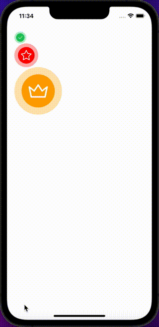

## Import

```jsx
import { RadioButton } from '@nomada-sh/react-native-eyecandy';
```

## Example

```tsx
import React from 'react';
import { ScrollView } from 'react-native';

import { RadioButton } from '@nomada-sh/react-native-eyecandy';
import { Crown, Star } from '@nomada-sh/react-native-eyecandy-icons';

export default function RadioButtons() {
  const [v1, setV1] = React.useState<boolean>(true);
  const [v2, setV2] = React.useState<boolean>(true);
  const [v3, setV3] = React.useState<boolean>(true);

  return (
    <ScrollView
      contentContainerStyle={{
        padding: 20,
      }}
    >
      <RadioButton value={v1} onValueChange={setV1} />
      <RadioButton
        value={v2}
        onValueChange={setV2}
        size={64}
        activeColor="red"
        activeIcon={Star}
      />
      <RadioButton
        value={v3}
        onValueChange={setV3}
        size={128}
        activeColor="orange"
        activeIcon={Crown}
      />
    </ScrollView>
  );
}
```



## Props

### [TouchableWithoutFeedback Props](https://reactnative.dev/docs/touchablewithoutfeedback#props)

Inherits [TouchableWithoutFeedback Props](https://reactnative.dev/docs/touchablewithoutfeedback#props).

---

### `value`

| Type    |
| ------- |
| boolean |

---

### `onValueChange`

```jsx
(value: boolean) => void;
```

| Type     |
| -------- |
| function |

---

### `style`

These styles will be applied to the container view.

| Type       |
| ---------- |
| View Style |

---

### `activeColor`

| Type   |
| ------ |
| string |

---

### `size`

| Type   | Default |
| ------ | ------- |
| number | 32      |

---

### `activeColor`

| Type   |
| ------ |
| string |

---

### `activeIcon`

| Type             |
| ---------------- |
| [Icon](../icons) |

---

### `activeIconColor`

| Type   |
| ------ |
| string |
