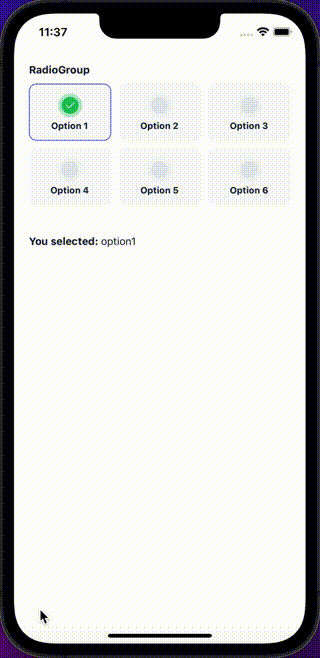

## Import

```jsx
import { RadioGroup } from '@nomada-sh/react-native-eyecandy';
```

## Example

```tsx
import React, { useState } from 'react';
import { ScrollView } from 'react-native';

import {
  Body,
  RadioGroup,
  RadioGroupItem,
} from '@nomada-sh/react-native-eyecandy';

export default function RadioGroups() {
  const [value, setValue] = useState<string | undefined>('option1');

  return (
    <ScrollView>
      <RadioGroup
        style={{
          padding: 20,
        }}
        title="RadioGroup"
        value={value}
        onChange={setValue}
      >
        <RadioGroupItem value="option1" label="Option 1" />
        <RadioGroupItem value="option2" label="Option 2" />
        <RadioGroupItem value="option3" label="Option 3" />
        <RadioGroupItem value="option4" label="Option 4" />
        <RadioGroupItem value="option5" label="Option 5" />
        <RadioGroupItem value="option6" label="Option 6" />
      </RadioGroup>
      {value ? (
        <Body
          weight="bold"
          style={{
            margin: 20,
          }}
        >
          You selected: <Body weight="normal">{value}</Body>
        </Body>
      ) : null}
    </ScrollView>
  );
}
```



## Props

### [View Props](https://reactnative.dev/docs/view#props)

Inherits [View Props](https://reactnative.dev/docs/view#props).

---

### <div class="label required basic">Required</div>**`children`**

| Type                                                                   |
| ---------------------------------------------------------------------- |
| [RadioGroupItem](radiogroupitem) or [RadioGroupItem](radiogroupitem)[] |

---

### `title`

| Type   |
| ------ |
| string |

---

### `value`

| Type |
| ---- |
| any  |

---

### `onChange`

```jsx
(value: any) => void;
```

| Type     |
| -------- |
| function |

---

### `gap`

| Type   | Default |
| ------ | ------- |
| number | `10`    |

---

### `itemsPerRow`

| Type   | Default |
| ------ | ------- |
| number | `3`     |

---

### `titleStyle`

| Type       |
| ---------- |
| Text Style |

---

### `itemLabelNumberOfLines`

| Type   |
| ------ |
| number |
