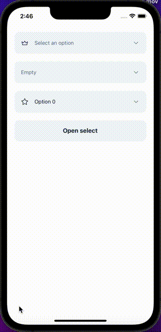

Selects allow the user to choose a single value from a list of options.

## Import

```jsx
import { Select } from '@nomada-sh/react-native-eyecandy';
```

## Example

```SnackPlayer name=RN%20Eyecandy%20Select
import React, { useRef } from 'react';
import { SafeAreaView, ScrollView } from 'react-native';

import {
  Button,
  Select,
  SelectItem,
} from '@nomada-sh/react-native-eyecandy';
import { Crown, Star } from '@nomada-sh/react-native-eyecandy-icons';

const items1 = [
  ...Array.from({ length: 100 }, (_, i) => ({
    label: `Option ${i}`,
    value: `option${i}`,
    icon: Crown,
  })),
];

const items2 = [
  ...Array.from({ length: 10 }, (_, i) => ({
    label: `Option ${i}`,
    value: `option${i}`,
    icon: Star,
  })),
];

export default function App() {
  const [v1, setV1] = React.useState(undefined);
  const [v2, setV2] = React.useState('option0');

  const ref = useRef(null);

  return (
    <SafeAreaView
      style={{
        flex: 1,
      }}
    >
      <ScrollView
        contentContainerStyle={{
          padding: 20,
        }}
      >
        <Select
          marginBottom={20}
          modalTitle="Select an option"
          placeholder="Select an option"
          icon={Crown}
          value={v1}
          items={items1}
          onChange={setV1}
        />
        <Select marginBottom={20} modalTitle="Select an item" emptyText="Empty" />
        <Select
          marginBottom={20}
          ref={ref}
          icon={Star}
          value={v2}
          items={items2}
          onChange={setV2}
          hideClearIcon
        />
        <Button
          marginBottom={20}
          onPress={() => {
            ref.current?.focus();
          }}
        >
          Open select
        </Button>
      </ScrollView>
    </SafeAreaView>
  );
}
```

<!--  -->

## Props

### `items`

| Type                        | Default |
| --------------------------- | ------- |
| [SelectItem](#selectitem)[] | `[]`    |

---

### `onChange`

```jsx
(value: any | undefined, index: number) => void;
```

| Type     |
| -------- |
| function |

---

### `value`

| Type |
| ---- |
| any  |

---

### `placeholder`

| Type   | Default                |
| ------ | ---------------------- |
| string | `'Select and item...'` |

---

### `onFocus`

```jsx
() => void;
```

| Type     |
| -------- |
| function |

---

### `onBlur`

```jsx
() => void;
```

| Type     |
| -------- |
| function |

---

### `isSelected`

```jsx
(item: SelectItem, value: any) => boolean;
```

| Type     |
| -------- |
| function |

- 'item' ([SelectItem](#selectitem)): item to check.
- 'value' (any): value passed with the [`value`](#value) prop.

---

### `closeOnSelect`

| Type    |
| ------- |
| boolean |

---

### `modalTitle`

| Type   |
| ------ |
| string |

---

### `emptyText`

| Type   | Default      |
| ------ | ------------ |
| string | `'No items'` |

---

### `hideClearIcon`

| Type    |
| ------- |
| boolean |

---

### `icon`

| Type             |
| ---------------- |
| [Icon](../icons) |

---

### `color`

| Type                     | Default     |
| ------------------------ | ----------- |
| `'default'` or `'error'` | `'default'` |

---

### `variant`

| Type                        | Default     |
| --------------------------- | ----------- |
| `'default'` or `'outlined'` | `'default'` |

---

### `style`

| Type       |
| ---------- |
| View Style |

---

### `marginTop`

| Type   |
| ------ |
| number |

---

### `marginBottom`

| Type   |
| ------ |
| number |

## Type definitions

### SelectItem

| Type   |
| ------ |
| object |

#### Properties

| Name  | Type             | Required | Description             |
| ----- | ---------------- | -------- | ----------------------- |
| value | any              | Yes      | The value of the option |
| label | string           | Yes      | The label of the option |
| icon  | [Icon](../icons) | No       | The icon of the option  |
| key   | string           | No       | The key of the option   |
