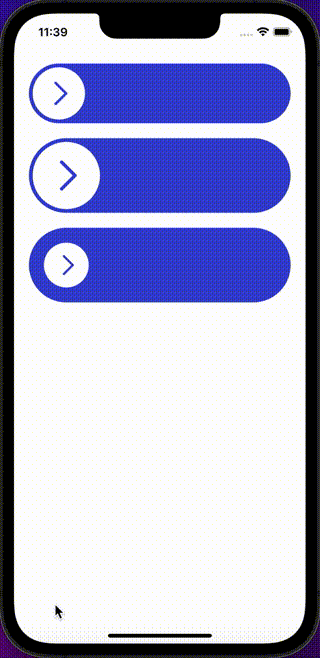

SwipeButtons are buttons that can be swiped to the left or right to trigger an action.

## Import

```jsx
import { SwipeButton } from '@nomada-sh/react-native-eyecandy';
```

## Example

```SnackPlayer name=RN%20Eyecandy%20SwipeButton
import React from 'react';
import { SafeAreaView, ScrollView, useWindowDimensions, Alert } from 'react-native';

import { SwipeButton } from '@nomada-sh/react-native-eyecandy';

export default function App() {
  const { width } = useWindowDimensions();

  return (
    <SafeAreaView
      style={{
        flex: 1,
      }}
    >
      <ScrollView
        contentContainerStyle={{
          padding: 20,
        }}
      >
        <SwipeButton
          marginBottom={20}
          width={width - 40}
          onSuccess={() => Alert.alert('Success')}
          onFail={() => Alert.alert('Fail')}
        />
        <SwipeButton marginBottom={20} width={width - 40} height={100} />
        <SwipeButton width={width - 40} height={100} padding={20} />
      </ScrollView>
    </SafeAreaView>
  );
}
```

<!--  -->

## Props

### <div class="label required basic">Required</div>**`width`**

| Type   |
| ------ |
| number |

---

### `height`

| Type   | Default |
| ------ | ------- |
| number | `80`    |

---

### `title`

| Type   |
| ------ |
| string |

---

### `padding`

| Type   | Default |
| ------ | ------- |
| number | `5`     |

---

### `onFail`

```jsx
() => void;
```

| Type     |
| -------- |
| function |

---

### `onSuccess`

```jsx
() => void;
```

| Type     |
| -------- |
| function |

---

### `marginTop`

| Type   |
| ------ |
| number |

---

### `marginBottom`

| Type   |
| ------ |
| number |
