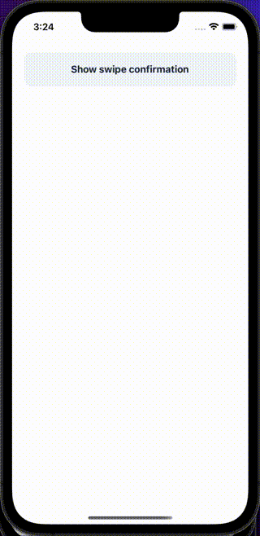

SwipeConfirmations are [BottomSheets](bottomSheet) used to add a confirmation to any action in your app that is invoked with a [ButtonSwipe](buttonswipe). This is useful for things like deleting items or taking some other destructive action. 

## Import

```jsx
import { SwipeConfirmation } from '@nomada-sh/react-native-eyecandy';
```

## Example

```SnackPlayer name=RN%20Eyecandy%20SwipeConfirmation
import React from 'react';
import { Alert, ScrollView } from 'react-native';

import {
  SwipeConfirmation,
  Button,
} from '@nomada-sh/react-native-eyecandy';

export default function App() {
  const [visible, setVisible] = React.useState(false);

  return (
    <ScrollView
      contentContainerStyle={{
        padding: 20,
        justifyContent: 'center',
        flex: 1,
      }}
    >
      <Button onPress={() => setVisible(true)}>
        Show swipe confirmation
      </Button>
      <SwipeConfirmation
        title="Swipe to confirm"
        visible={visible}
        onClose={() => setVisible(false)}
        onConfirm={() => {
          Alert.alert('Swipe confirmed');
          setVisible(false);
        }}
        swipeTitle="Swipe me"
      />
    </ScrollView>
  );
}
```

<!--  -->

## Props

### [BottomSheet Props](bottomSheet#props)

Inherits [BottomSheet Props](bottomSheet#props)

---

### <div class="label required basic">Required</div>**`title`**

| Type   |
| ------ |
| string |

---

### `swipeTitle`

| Type   |
| ------ |
| string |

---

### `onConfirm`

```jsx
() => void;
```

| Type     |
| -------- |
| function |

---

### `style`

| Type       |
| ---------- |
| View Style |
