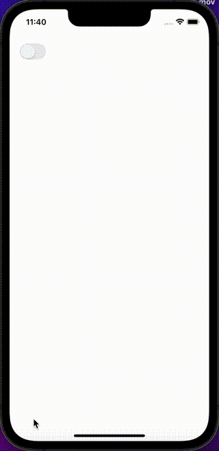

Switch represents user's decision of a process and indicates whether a state is on/off.

## Import

```jsx
import { Switch } from '@nomada-sh/react-native-eyecandy';
```

## Example

```SnackPlayer name=RN%20Eyecandy%20Switch
import React from 'react';
import { ScrollView } from 'react-native';

import { Switch } from '@nomada-sh/react-native-eyecandy';

export default function App() {
  const [value, setValue] = React.useState(false);

  return (
    <ScrollView
      contentContainerStyle={{
        padding: 20,
      }}
    >
      <Switch value={value} onValueChange={setValue} />
    </ScrollView>
  );
}
```

<!--  -->

## Props

### [Switch Props](https://reactnative.dev/docs/switch#props)

Inherits [Switch Props](https://reactnative.dev/docs/switch#props).

---

### `color`

| Type        | Default     |
| ----------- | ----------- |
| `'default'` | `'default'` |
