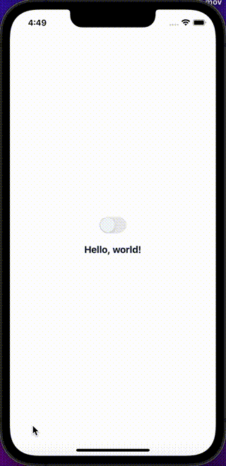

# Theme

## Installation

```bash npm2yarn
npm install @nomada-sh/react-native-eyecandy-theme
```

## Example

```tsx
import React from 'react';

import { View } from 'react-native';

import {
  ThemeProvider,
  DefaultTheme,
  DarkTheme,
} from '@nomada-sh/react-native-eyecandy-theme';

import { Body, Switch } from '@noma-sh/react-native-eyecandy';

export default function App() {
  const [dark, setDark] = React.useState(false);

  return (
    <ThemeProvider theme={dark ? DarkTheme : DefaultTheme}>
      <View
        style={{
          flex: 1,
          justifyContent: 'center',
          alignItems: 'center',
        }}
      >
        <Switch
          value={dark}
          onValueChange={setDark}
          style={{
            alignSelf: 'center',
            marginBottom: 20,
          }}
        />
        <Body weight="bold" size="xlarge">
          Hello, world!
        </Body>
      </View>
    </ThemeProvider>
  );
}
```


