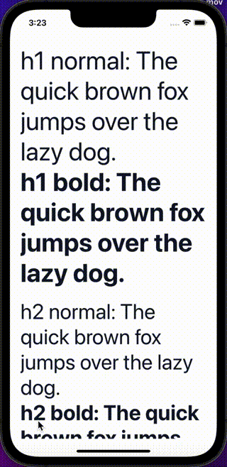

Heading displays words and characters of various sizes. They are typically used to display text headings.

## Import

```jsx
import { Heading } from '@nomada-sh/react-native-eyecandy';
```

## Example

```tsx
import React from 'react';
import { ScrollView, View } from 'react-native';

import { Heading } from '@nomada-sh/react-native-eyecandy';
import {
  ThemeHeadingVariants,
  ThemeTextWeights,
} from '@nomada-sh/react-native-eyecandy-theme';

const variants: ThemeHeadingVariants[] = ['h1', 'h2', 'h3', 'h4', 'h5', 'h6'];

const weights: ThemeTextWeights[] = ['normal', 'bold'];

export default function App() {
  return (
    <ScrollView
      contentContainerStyle={{
        padding: 20,
      }}
    >
      {variants.map(variant => (
        <View
          key={variant}
          style={{
            marginBottom: 20,
          }}
        >
          {weights.map(weight => (
            <Heading key={weight} variant={variant} weight={weight}>
              {`${variant} ${weight}`}: The quick brown fox jumps over the lazy
              dog.
            </Heading>
          ))}
        </View>
      ))}
    </ScrollView>
  );
}
```



## Props

### [Text Props](text#props)

Inherits [Text Props](text#props)

---

### `variant`

This variant is used to set the font size.

Possible values:

- `'h1'` uses a font size of `48`.
- `'h2'` uses a font size of `40`.
- `'h3'` uses a font size of `32`.
- `'h4'` uses a font size of `24`.
- `'h5'` uses a font size of `20`.
- `'h6'` uses a font size of `18`.

| Type                                                     | Default |
| -------------------------------------------------------- | ------- |
| `'h1'` or `'h2'` or `'h3'` or `'h4'` or `'h5'` or `'h6'` | `'h1'`  |
