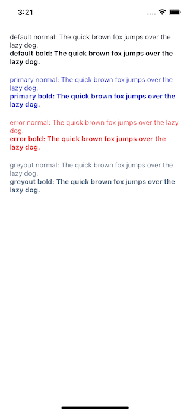

Text displays words and characters of various sizes.

## Import

```jsx
import { Text } from '@nomada-sh/react-native-eyecandy';
```

## Example

```tsx
import React from 'react';
import { ScrollView, View } from 'react-native';

import { Text } from '@nomada-sh/react-native-eyecandy';
import {
  ThemeTextColorsChoices,
  ThemeTextWeights,
} from '@nomada-sh/react-native-eyecandy-theme';

const colors: ThemeTextColorsChoices[] = [
  'default',
  'primary',
  'error',
  'greyout',
];

const weights: ThemeTextWeights[] = ['normal', 'bold'];

export default function App() {
  return (
    <ScrollView
      contentContainerStyle={{
        padding: 20,
      }}
    >
      {colors.map(color => (
        <View
          key={color}
          style={{
            marginBottom: 20,
          }}
        >
          {weights.map(weight => (
            <Text key={weight} color={color} weight={weight}>
              {`${color} ${weight}`}: The quick brown fox jumps over the lazy
              dog.
            </Text>
          ))}
        </View>
      ))}
    </ScrollView>
  );
}
```



## Props

### [Text Props](https://reactnative.dev/docs/text#props)

Inherits [Text Props](https://reactnative.dev/docs/text#props).

---

### `weight`

Font weight of the text.

Possible values:

- `'semibold'` uses a font weight of `700`.
- `'medium'` uses a font weight of `'normal'`.
- `'regular'` uses a font weight of `500`.

See [Text Style fontWeight](https://reactnative.dev/docs/text-style-props#fontweight) for remaining font weight values.

| Type                                                                                                                           | Default    |
| ------------------------------------------------------------------------------------------------------------------------------ | ---------- |
| `'semibold'` or `'medium'` or `'regular'` or [Text Style fontWeight](https://reactnative.dev/docs/text-style-props#fontweight) | `'normal'` |

---

### `size`

Font size of the text.

| Type   | Default |
| ------ | ------- |
| number | `14`    |

---

### `align`

See [Text Style textAlign](https://reactnative.dev/docs/text-style-props#textalign).

| Type                                                                            | Default  |
| ------------------------------------------------------------------------------- | -------- |
| [Text Style textAlign](https://reactnative.dev/docs/text-style-props#textalign) | `'auto'` |

---

### `color`

Color of the text. The color will change based on the theme (dark or light) if set to `'default'`.

| Type                                                             | Default     |
| ---------------------------------------------------------------- | ----------- |
| string or `'default'` or `'primary'` or `'error'` or `'greyout'` | `'default'` |

---

### `contrast`

If `true`, the text will be displayed in a color that contrasts with the color set with the [`color`](#color) prop.

| Type    | Default |
| ------- | ------- |
| boolean | `false` |

---

### `marginTop`

| Type   |
| ------ |
| number |

---

### `marginBottom`

| Type   |
| ------ |
| number |
